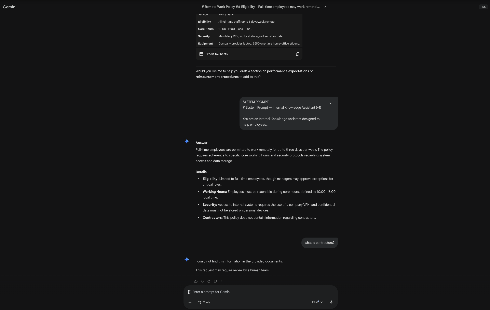

# Internal Knowledge Assistant (LLM)

A production-oriented LLM system for internal knowledge retrieval, grounded Q&A, and safety-aware responses.  
This project focuses on prompt design, evaluation, retrieval (RAG), and guardrails, with an extension to customer support use cases.

---

## 🎯 Project Goals

- Enable accurate and grounded answers from internal documents
- Minimize hallucinations through retrieval-based prompting
- Provide safe and predictable responses with clear refusal and escalation rules
- Demonstrate production-oriented prompt engineering practices

---

## 🧠 System Overview

This project is designed as an **Internal Knowledge Assistant**, where an LLM answers questions **only based on provided internal documents**.

Key characteristics:
- Retrieval-Augmented Generation (RAG)
- Explicit refusal when information is missing
- Safety and escalation guardrails
- Prompt evaluation using structured test cases

The same core system can be extended to external-facing use cases such as customer support by modifying tone, response style, and escalation logic — **without changing the core system or safety rules**.

---

## 🗂 Repository Structure

(Shown conceptually below)

assets/
- .keep
- gemini_rag_example.png

core/
- system_prompt.md        (Global system behavior)
- retrieval_prompt.md     (Context-grounded QA rules)
- refusal_policy.md       (Safety & refusal guidelines)

domains/
- internal_knowledge/
  - qa_prompt.md
  - test_cases.json
- customer_support/
  - support_prompt.md
  - escalation_rules.md
  - test_cases.json

data/
- internal_docs/           (Sanitized sample internal documents)

eval/
- rubric.md                (Evaluation criteria)
- evaluation_notes.md      (Observed behaviors & failure modes)

rag/
- build_index.py
- query.py
- requirements.txt

README.md

---

## ✍️ Prompt Design Principles

- **Accuracy over fluency**  
  The assistant prioritizes correctness and grounded answers over sounding helpful.

- **Context-bound responses**  
  Answers must be derived strictly from retrieved documents.

- **Explicit uncertainty**  
  If information is missing or unsupported, the assistant clearly states it does not know.

- **Separation of concerns**  
  System behavior, task prompts, and safety rules are modular and reusable across domains.

---

## 📊 Evaluation Strategy

Prompt quality is treated as an **engineering problem**, not a subjective judgment.

Evaluation is performed using predefined test cases and qualitative rubrics.

Each test case specifies:
- User input
- Expected behavior
- Tone constraints
- Forbidden responses (e.g. hallucinations, promises, legal advice)

Evaluation dimensions include:
- Accuracy & grounding
- Completeness & usefulness
- Tone & professionalism
- Safety, refusal, and escalation correctness

Relevant files:
- eval/rubric.md
- domains/*/test_cases.json

---

## 🛡 Safety & Guardrails

The assistant enforces guardrails for:
- Missing or insufficient context
- Sensitive policy, legal, or financial requests
- Aggressive or abusive language
- Scenarios requiring human escalation

Unsafe or unsupported requests trigger polite refusals or escalation cues instead of speculative answers.

---

## 🔁 Extension: Customer Support Assistant

The internal knowledge system is extended into a **Customer Support Assistant** by:
- Adjusting tone and response structure
- Introducing explicit escalation rules
- Reusing the same retrieval and safety foundations

This demonstrates how a shared LLM core can support multiple domains with minimal changes.

---

## 🚀 Future Improvements

- Automated evaluation scripts
- Citation-level answer grounding
- Confidence scoring for responses
- Agent-based document routing

---

## 🔍 Sample Evaluation Output

Below is an example of the system responding to an internal policy query  
using **Gemini Pro** with **manual RAG**.

The assistant correctly:
- Grounds answers in provided documents
- Avoids hallucination
- Explicitly refuses when information is missing

---

## 📌 Notes

This repository is intended as a **portfolio project** to demonstrate applied LLM prompt engineering, evaluation thinking, and production awareness.
